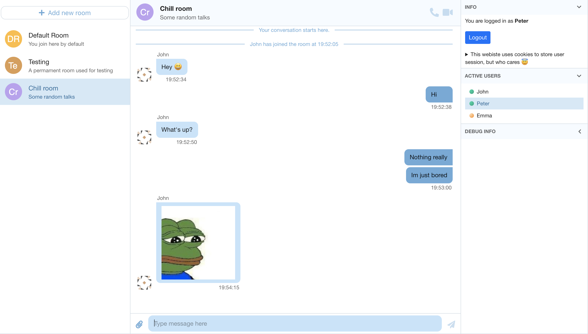

# ChatRooms

A distributed system example - chat rooms project using Socket.io. Written as an experiment to try out Flask and Socket.io.

> The app is not production ready, it has some design flaws and bad practices. However, it may serve as an example. Please contact me if you have any questions.

#### Features

- Simple chat application, with the following rules:
  - Type in a nickname and enter chat
  - Join any chat room by selecting it from the list on the left
  - Users cannot see messages from before they joined
  - When switching rooms, previous chat history is no longer visible to users after rejoining
  - When last user leaves a room, it is automatically deleted (except persistent rooms like the default one)
- Possibility to send image attachments
- Displays list of active users
- Automatically generated avatars for users and rooms
- Technical stack:

  - React/Typescript frontend + chat-ui-kit-react lib
  - Python/Flask backend
  - Socket.IO for websocket communication, using Flask-SocketIO library
  - Node.js/Express server acting as API Gateway/Proxy for Python server. Also used for hosting React client static files.
  - Docker-compose based architecture
  - Github Actions CI pipeline with deploy to VPS Docker with nginx-proxy
  - Attachment Image hosting at imgbb.com

  

## Local development

Requirements:

- Python 3.8+
- [Node 14 LTS](https://nodejs.org/en/download/)
- [Yarn 1.22](https://classic.yarnpkg.com/en/docs/install/#windows-stable) (The classic stable version)
- [optional] [Docker Desktop](https://www.docker.com/products/docker-desktop) & [Docker Compose](https://docs.docker.com/compose/install/)

### Installation

Installing API server python dependencies:

```sh
cd server
pip3 install -r requirements.txt
```

> **IMPORTANT NOTE:** Remember to update `requirements.txt` every time you add a new dependency! It's a good idea to run this each time you pull from git.

Installing Web Client dependencies

```sh
cd client
yarn install
```

> The above step should be ran each time you pull from git (during active development), because of possible dependency changes in `package.json`.

### Running locally

#### API Server

API Server is based on Python [`flask-socketio`](https://flask-socketio.readthedocs.io/en/latest/). To start development server:

```sh
cd server
python3 app.py
```

The API server starts at http://localhost:5000.

##### Quick testing the API server

To test server without worrying about running heavyweight React client, you can use:

- prepared for this purpose `server/browser_playground` HTML files - see [`README.md`](./server/browser_playground/README.md) in there.
- Postman - for HTTP communication with Flask endpoints
- [This awesome tool](https://amritb.github.io/socketio-client-tool/) - just enter `ws://localhost:5000/chat` and connect. You can communicate with server without writing any client-side code! The `/chat` URI means that you are connecting to a `chat` Socket.IO namespace instead of default `/` namespace.

#### Web Client

To start web client locally:

```sh
cd client
yarn start
```

Now you can run app at http://localhost:3000. It requires the API server to be running.

> In order to be able to send attachments, you need to rename `.env.development.local.example` to `.env.development.local` and paste your imgBB API key there.

## Deploying production build to local docker

There is possibility to deploy the app into local docker environment.

1. Go into `client` directory and rename file `.env.production.local.example` to `.env.production.local` and paste your imgBB API key there.
2. Start compose project

```sh
docker-compose up -d --build
```

Both client and API server containers will be rebuilt (`--build` flags) and finally the client app will be listening on http://localhost:4121. The API server will be available at http://localhost:4121/api/

### Modifying client proxy server (without docker)

Client is hosted in a separate container using `express` server. It also acts as a proxy to the Flask API server at `/api` endpoint. The server code is located at `client/server/server.js`.

To start the proxy server:

1. `cd` into `client/server`
2. `yarn start` (do `yarn install` before if running for the first time)
3. The proxy server will start at http://localhost:4121. If Python API server is listening at port `5000`, it will be available at http://localhost:4121/api.
4. To make client app available at port `4121`, you need to build it first by runniny `yarn build` from the `client` directory.

## Deploying to production server

To deploy app to publicly exposed production server (contact me to get address), do the following:

1. Create a Pull Request with your changes.
2. Wait for all checks to complete and for approval code review.
3. Merge into `main`.
4. Go into Actions tab on GitHub (top menu).
5. Wait again for both Client and Server workflows to go green.
6. Enter `Deploy` workflow on the left.
7. Click `Run Workflow` on the right (select `main` branch), then click the green button.
8. Wait for workflow to complete. The app is now live!
